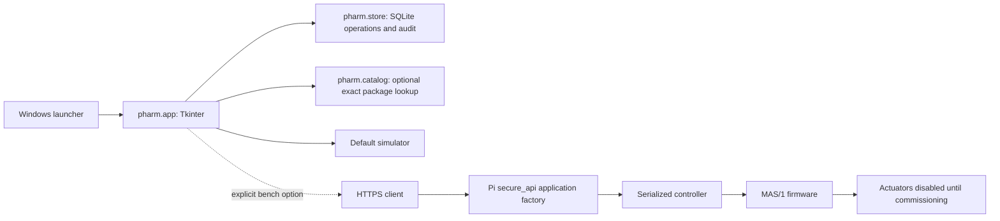

> September 25 update: hardware choices are open for a redesign. Simulation is the default; electrical configuration is separate from the desktop workflows. Historical installation and account notes below describe earlier versions.

# Software remediation

This document supersedes the software status in the original project review. The original review and supplied inventory examples are preserved for context.

## September 25 redesign software fixes

The application can be developed and exercised without selecting the final locks, relay board, sensors, or scanner. The existing four-compartment inventory model and adapter interface remain in place.

- Moved hardware configuration into `UI/HardwareConfig.h`, with unset pins, polarity, pulse/rest timing, and optional lighting. Enabled builds reject incomplete, duplicate or conflicting settings at compile time. Neither historical wiring map is adopted as the new design.
- Replaced the fixed 30-second release hold with a configured, nonblocking pulse and per-drawer rest period. Repeated commands cannot extend a pulse; an explicit lock request ends it. Lighting has an independent timer. The firmware remains disabled in the source and no board was uploaded.
- Fixed loading without a catalog: scanning a valid numeric identifier now populates manual entry instead of producing a dead-end lookup error. Ambiguous matches retain the scanned identifier without choosing a product. Matching top-up scans preserve existing lot, expiration and counted unit; different scans clear those details. Enter-key scans are ignored during a device request.
- Added **Choose catalog**, remembered separately for simulation and bench use, and a `--catalog` session override. Invalid selections preserve the active catalog; malformed saved preferences fall back to the default path.
- Simplified the simulation banner and updated setup guidance for the redesign. Scanner input remains brand-independent keyboard input for exact numeric identifiers. Composite GS1/Data Matrix parsing and physical closure sensing are still explicit extension points, not assumed capabilities.

Validation on September 25, 2026:

- 68 application, catalog, inventory, API and workflow regression tests passed on Windows.
- Four additional tests exercised the actual Tk loading controls with disposable stock: no-catalog entry, matching top-up, clearing a changed identity, and Enter-key handling during a device request. All passed.
- Four firmware test groups passed using the installed Ubuntu C++ compiler. They compile and execute the actual sketch against simulated pins, serial and time, checking disabled outputs, both release polarities, pulse cutoff under serial traffic, repeat-command rejection, rest timing, explicit lock behavior, optional lighting, unsigned timer rollover, and compile-time rejection of invalid profiles. Windows does not have a complete host C++ setup, so those four groups were run in Ubuntu instead.
- The default disabled Uno firmware compiled: 2,450 bytes flash, 220 bytes RAM. A synthetic enabled profile with lighting compiled: 4,706 bytes flash, 267 bytes RAM. The enabled profile exists only in ignored test output; its timing and wiring are test values, not hardware recommendations.
- The standard launcher smoke test rendered the simulation dashboard and loading form successfully. Tests used temporary or separate test databases. No serial port was opened, no firmware was uploaded, and no live stock was edited.

## September 18 Uno USB timeout repair

### Subsequent physical USB verification

After the user confirmed that only USB was connected, the board's bootloader returned ATmega328P signature `0x1e950f`. Its previous flash was backed up to `.test-output/arduino/uno-before-usb-repair.hex` before replacement. The backup contained legacy debug strings (`Starting up!`, `got here`, `lockPin set high`) and no `MAS/1` protocol text.

Uploaded the default disabled build of `UI/LockLights.ino` to COM3. AVRDUDE verified all 2,844 uploaded bytes against the compiled image. A fresh connection using the app's USB-opening code at 9600 baud sent HELLO byte 0 and received exactly `MAS/1 DISABLED`. This establishes working USB communication with the matching firmware. No actuator command was sent. No inventory record was modified. Drawer access and reconciliation remain unavailable until actual lock hardware is connected and the firmware is commissioned. For a dummy-stock workflow with only USB connected, use the simulation launcher and its separate database.

The following validation notes describe the earlier software-only stage, before this upload.

The reported command-0 timeout occurs during MAS/1 readiness negotiation, before a drawer command. The connected board is now reported as an Uno; its installed sketch is unknown. Read-only serial enumeration found a CH340 adapter at COM3. Neither enumeration nor a successful software test identifies the installed firmware.

- Added up to three silent HELLO attempts on a fresh connection to tolerate startup after USB reset. Disabled/incompatible replies stop immediately. Drawer commands are still sent only once.
- Separated connection/HELLO failures from failures after an actuator command. The USB error includes the port and firmware setup guidance. Disabled builds explicitly identify `HARDWARE_COMMISSIONED=0`.
- Cancel new operations known to have failed before sending a drawer command, preserving stock and auditing `access_not_sent`. Existing reconciliation and verified access cannot be cleared through this path. Unknown failures still require reconciliation.
- Corrected Nano-only UI/setup wording to include Uno and documented installing the matching sketch, disabled versus enabled builds, and recovery of existing pending records.

Validation: all 61 Python tests passed, including ten new startup/protocol/inventory regression cases. The Windows UI smoke test rendered the USB chooser, dashboard and loading form using a fake port. The default sketch compiled for `arduino:avr:uno` with the local AVR/NeoPixel toolchain (2,844 bytes flash, 220 bytes RAM). Tcl/Tk and Arduino compilation required normal Windows execution because the sandbox could not load their bundled resources. No board serial port was opened, firmware uploaded, actuator driven, or live inventory edited. Physical USB operation remains unverified until the installed sketch and wiring are established.

## Implemented

- Replaced the active UI's direct JSON writes with a SQLite inventory/application layer in `pharm/`, using explicit transactions and one outstanding operation across local app processes.
- Persisted access intent before requesting hardware. Partial scans, failed access/lock requests, cancellation after access, and restart leave a recoverable operation. Administrator reconciliation records an observed count and reason instead of guessing the physical result.
- Validated quantities, compartment IDs, required product fields, actual expiration format/date, stock availability, and top-up identity/lot/unit compatibility. Zero stock clears the product. Duplicate access and duplicate commit are rejected.
- Added local administrator/operator accounts, salted password hashes, attributable audit events, manual-access reasons, audit export, and consistent backups. Loading/unloading/reconciliation are administrator actions.
- Rebuilt the UI with refreshed compartment cards, explicit simulation status, independent scanner focus, and separate lookup/commit steps. Device calls run in a single worker with bounded HTTP/serial waits.
- Removed startup dependencies on OpenCV, ZBar, Pillow, dotenv, requests, and BeautifulSoup from the maintained desktop UI. It uses the Python standard library. Missing or malformed catalog files produce an actionable notice instead of preventing startup.
- Replaced substring/integer barcode matching with exact string-based lookup, preserving leading zeros and rejecting ambiguous UPC package mappings. Catalog listing dates no longer become medication expiration dates.
- Retired remote image scraping from loading. Optional local image helpers cannot traverse arbitrary paths. The UI no longer depends on images.
- Consolidated API variants into one application factory with no import-time serial connection. Added unique endpoints, strict request schemas, correct helper signatures, serial error propagation, size limits, and hardware-aware readiness.
- Replaced conflicting serial definitions with MAS/1, serialized command ownership, a commissioning/version probe, explicit single-compartment selection, and firmware acknowledgement checks. Firmware rejects invalid command bytes before indexing arrays and includes bounded output access time in enabled builds.
- Replaced the source credential with a placeholder requiring external configuration. The API runs on loopback behind HTTPS; desktop bench mode requires certificate-verified HTTPS. The setup script no longer overwrites source or starts a service automatically.
- Added a Windows double-click launcher, standard-library desktop requirements, pinned Pi dependencies, regression tests, and generated-data ignore rules. `UI/main.py` remains a supported entry point. Old standalone edit entry now delegates to the maintained UI; old mutating screen modules cannot continue writing the retired JSON inventory.

## Current architecture

## Verification

The automated suite covers exact/ambiguous/malformed catalog inputs, account permissions, validation, stock depletion/top-up/unload, backup handles, audit immutability, duplicate operations, restart recovery, API registration and errors, serial failure/no-retry behavior, command serialization, and UI workflow success/failure/cancellation through mocked dialogs and simulated hardware.

The normal Windows launcher smoke test renders actual Tkinter sign-in, dashboard, and loading screens, then exits using disposable simulation storage. No real medication data or actuator is used in tests.

Verification completed September 11, 2026:

- 44 automated Python tests passed on Python 3.12.14, including real Flask test-client requests with a fake serial device.
- The actual `Launch Pharmacy Drawer.cmd` successfully ran the Windows screen-rendering smoke test and exited with code 0.
- `LockLights.ino` compiled for the representative Arduino Uno target using AVR core 1.8.6 and Adafruit NeoPixel 1.12.5. Both the default disabled build (2,840 bytes flash) and a compile-only enabled build (4,340 bytes flash) passed. The enabled build was made only in the ignored test directory; the source still defaults to disabled.
- The official Arduino download resolved to CLI 1.5.2-rc.1 for this check. The actual board is still unknown; these compile results establish representative AVR build compatibility, not validation of the installed hardware.
- No firmware was uploaded, serial port opened, Pi service installed, or physical lock actuated.

## Deliberately unresolved hardware and operational requirements

The software runs in simulation now. Physical door/lock sensors, electrical fail states, emergency all-compartment access, scanner formats beyond simple numeric identifiers, pharmacy stock-unit conventions, and actual board configuration cannot be established from source. The implementation exposes these limits instead of claiming physical confirmation. An administrator must confirm closure manually in bench mode; this is not a substitute for sensor integration and commissioning.

The actual medication catalog remains unavailable. Manual verified entry is supported; synthetic test data is not promoted to a drug database. Legacy example stock is preserved, not silently migrated as trusted stock. Any real deployed key from the original source needs rotation on the owning device; only the local copy was removed.

The current store is for one cabinet and one desktop installation. It is not a centralized inventory server for multiple independent workstations. Local audit/password protection does not protect against a privileged filesystem administrator. A production Pi service, reverse proxy/certificates, account recovery policy, and pharmacy release procedure must be configured for the actual installation.

The separate root stepper experiment and `old-files/` remain historical and are not imported by the launcher or supported as pharmacy control software.
